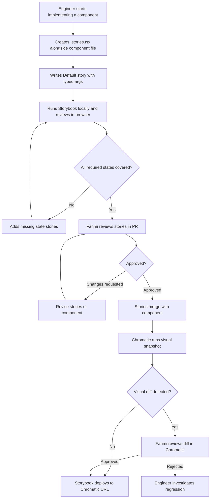
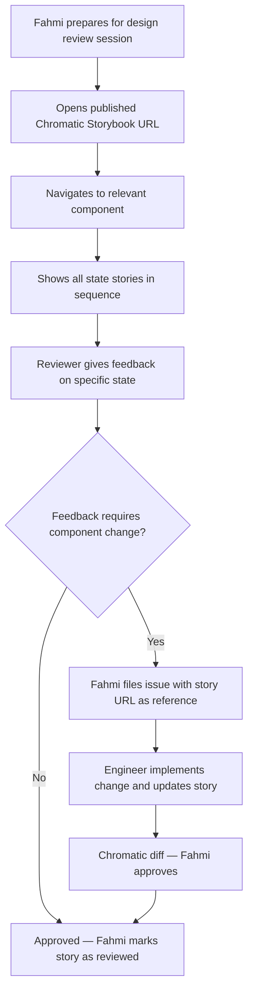
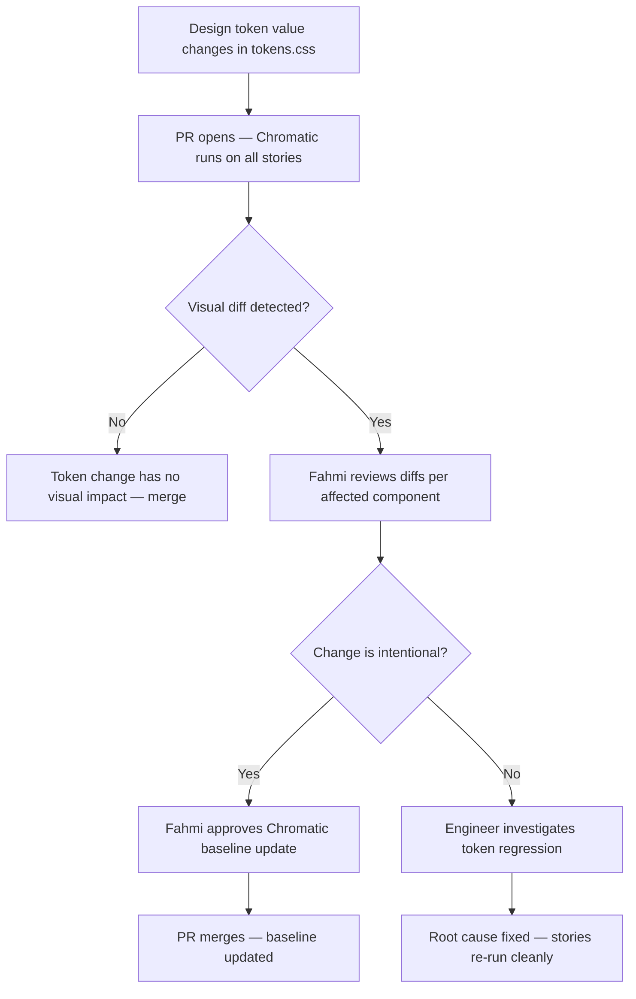

# Storybook Component Architecture — Moji Design System

**Prepared by:** Fahmi
**Status:** Draft
**Last Updated:** March 15, 2026
**Scope:** Internal tooling / Design system infrastructure
**Audience:** Fahmi, Raph (CPO), Andy, Sam

---

## 1. Problem Statement

The Moji component library (`jimo-component-library`) provides 13 production components — Button, Chip, Checkbox, Toggle, Radio, Input, Toast, Infobox, DropdownSelector, DropdownMenuList, DropdownMenuGroup, Tooltip, and Icon — along with a full design token system. Today, this library is documented through a custom-built doc site and a machine-readable `COMPONENTS.md`. While that setup is effective for Claude Code references, it does not support interactive state browsing, visual regression testing, or live design review.

There is no isolated workshop environment where components can be reviewed across all their variants — size, semantic type, interaction state, disabled, error — without running the full application. Design reviews require navigating to specific states in the running app or reading static Figma frames. Dev handoff relies on `COMPONENTS.md` annotations rather than a living reference that reflects what is actually in production.

The core unmet need is: **a single interactive source of truth for every component state, accessible by link, with visual regression protection and a direct bridge to the Figma design system.**

---

## 2. Goals

- Migrate the Moji component library from its current custom doc site to a Storybook instance that covers all design levels (Foundations through Molecules), scoped exactly to what exists in `jimo-component-library` — no additional components.
- Enable any team member to review any component state — every variant, status, size, and interaction state — via a shareable URL without running the application.
- Expose every meaningful prop as a live control in a `Playground` story so that variant combinations can be explored interactively without touching code.
- Establish a Figma-to-Storybook link per story using `@storybook/addon-designs` so that design intent and implementation can be compared in one step.
- Connect Chromatic for visual snapshot testing on every PR that touches a story file, with the published URL always reflecting `main`.
- Follow a clean migration path from the existing `jimo-component-library` doc site to Storybook without introducing scope creep or new components.

---

## 3. Target Users

### Primary: Fahmi (Product Designer & Product Specialist)
Fahmi is the author and primary maintainer of this Storybook. He uses it as a design QA environment during Figma-to-dev handoff, as a live reference during design reviews with Raph (showing all component states without switching tools), and as a regression harness before changes reach Andy or Sam. His workflow follows: PRD in Linear → Figma prototype → Raph review → Andy tech review → iterate → handoff. Storybook extends this workflow as the handoff artifact that supplements or replaces annotated Figma.

### Secondary: Andy & Sam (Engineering)
Andy and Sam receive Storybook stories as a spec supplement and development harness. They write stories alongside implementation (Story-Driven Development) so components are always testable in isolation. They use stories for regression catching when a shared atom is changed.

### Tertiary: Raph (CPO)
Raph reviews designs in Figma today. With a published Storybook, he gains a live preview environment where all component states are accessible without opening the application. This is particularly valuable for reviewing semantic variants (e.g., all five `Infobox` types) and interaction states (e.g., all `Input` statuses) simultaneously.

---

## 4. Use Cases

**UC-1: Reviewing all component variants before dev handoff**
A designer finishes designing a form section that uses Input with multiple statuses and Infobox for persistent alerts. Instead of annotating each state in Figma separately, they share the `Input/Playground` story URL and the specific status stories. The reviewer opens the link, sees all states live, and can interact with controls to explore edge cases. No app setup required.

**UC-2: Catching visual regressions when a shared atom changes**
An engineer changes the `Chip` component to adjust padding for the `xx-small` size. Without Storybook, the risk is that other uses of Chip in the interface break silently. With Storybook, Chromatic diffs the `Chip` stories on the PR and flags the visual change for review before it reaches staging.

**UC-3: Exploring the Dropdown composition pattern in isolation**
The composed dropdown pattern (`DropdownSelector` + `DropdownMenuGroup` + `DropdownMenuList`) is not intuitive from reading props alone. A `Dropdown/Composed` story shows all three components wired together with interactive state, giving engineers a working reference they can copy directly.

**UC-4: Validating semantic color correctness across component types**
A design token changes — e.g., `--color-warning-default` is updated. Storybook stories for Toast, Infobox, Chip, and Input all render `warning` variants. Chromatic diffs all of them simultaneously, surfacing any component that did not update correctly.

**UC-5: Onboarding a new engineer to the design system**
A new engineer needs to understand what `Input` accepts, what its statuses look like, and when to use `Infobox` versus `Toast`. The Storybook auto-generates an Args table from TypeScript types, and each component has a `Playground` story. No Notion page or Figma spec is required to answer basic component API questions.

---

## 5. Proposed Solution

### 5.1 Migration Scope

This Storybook is a migration and transition of the existing `jimo-component-library` doc site. The component scope is frozen to what currently exists in that project. No new components are added as part of this migration.

**Components in scope (13 total):**

| Category | Components |
|---|---|
| Foundations | Typography tokens, Color tokens, Spacing tokens, Radius tokens, Shadow tokens, Icons |
| Atoms | Button, Checkbox, Toggle, Radio, Icon, Tooltip |
| Molecules | Input, Chip, DropdownSelector, DropdownMenuList, DropdownMenuGroup, Toast, Infobox |

### 5.2 Architecture

The Storybook sidebar tree follows atomic design levels. Because this is a pure component library with no application-level organisms, the tree stops at Molecules.

```
stories/
│
├── 0-foundations/
│   ├── Colors/
│   │   ├── BrandPalette.stories.tsx
│   │   ├── NeutralScale.stories.tsx
│   │   └── SemanticColors.stories.tsx
│   ├── Typography/
│   │   ├── Scale.stories.tsx
│   │   └── Weights.stories.tsx
│   ├── Spacing/
│   │   └── ScaleGrid.stories.tsx
│   ├── Radius/
│   │   └── ScaleGrid.stories.tsx
│   ├── Shadows/
│   │   └── ElevationScale.stories.tsx
│   └── Icons/
│       └── IconGallery.stories.tsx
│
├── 1-atoms/
│   ├── Button/
│   │   └── Button.stories.tsx
│   ├── Checkbox/
│   │   └── Checkbox.stories.tsx
│   ├── Toggle/
│   │   └── Toggle.stories.tsx
│   ├── Radio/
│   │   └── Radio.stories.tsx
│   ├── Icon/
│   │   └── Icon.stories.tsx
│   └── Tooltip/
│       └── Tooltip.stories.tsx
│
└── 2-molecules/
    ├── Input/
    │   └── Input.stories.tsx
    ├── Chip/
    │   └── Chip.stories.tsx
    ├── Dropdown/
    │   ├── DropdownSelector.stories.tsx
    │   ├── DropdownMenuList.stories.tsx
    │   ├── DropdownMenuGroup.stories.tsx
    │   └── DropdownComposed.stories.tsx
    ├── Toast/
    │   └── Toast.stories.tsx
    └── Infobox/
        └── Infobox.stories.tsx
```

### 5.3 Level 0 — Foundations

Foundations render design tokens as visual, interactive documentation. These are not component stories — no `component` field in the meta export. Every downstream component depends on these being correct.

**Colors**

| Story | Content |
|---|---|
| `BrandPalette` | Blue scale (50–500) with hex values and CSS variable names |
| `NeutralScale` | neutral-50 through neutral-800 with contrast ratio annotations against white and `--color-bg-default` |
| `SemanticColors` | All semantic aliases grouped by role: text, background, border, brand, status |

**Typography**

| Story | Content |
|---|---|
| `Scale` | All 13 composite tokens (`--text-heading-1..5`, `--text-subtitle-1..4`, `--text-body-1..4`) rendered with their CSS variable name, computed values (family, weight, size, line-height), and a sample sentence. Headings include letter-spacing annotation. |
| `Weights` | Montserrat 700 (heading), Montserrat 600 (subtitle), Inter 500 (body) — rendered side by side with the same sample text to show the difference. |

**Spacing**

| Story | Content |
|---|---|
| `ScaleGrid` | `--space-1` through `--space-12` (4px–48px) rendered as labeled squares with px values |

**Radius**

| Story | Content |
|---|---|
| `ScaleGrid` | `--radius-sm` through `--radius-full` rendered as filled squares showing the corner rounding progression |

**Shadows**

| Story | Content |
|---|---|
| `ElevationScale` | `--shadow-sm` through `--shadow-xl` rendered as white cards on a gray background with the CSS variable name and value |

**Icons**

| Story | Content |
|---|---|
| `IconGallery` | A browsable grid of iconsax-react icons at 20px, 24px, and 32px in both `Linear` and `Bold` variants. Includes `CloseIcon` and `SpinnerIcon` (the two custom icons from the library). Args: `size` (range), `variant` (select: Linear/Bold). |

### 5.4 Level 1 — Atoms

Atoms are pure UI primitives with zero domain knowledge. Every atom must cover: Default, all interactive states (hover, focus, active where applicable), disabled, size variants where applicable, and one `Playground` story with all props as live controls.

**Button**

The `level` prop maps to a `variant` control in Storybook argTypes — following the Storybook convention of using `variant` as the standard control name for visual style variants.

| Story | Description |
|---|---|
| `Default` | Primary level, big size, enabled |
| `Secondary` | Secondary level, big size |
| `Tertiary` | Tertiary level, big size |
| `Danger` | Primary + `danger=true` — destructive visual treatment |
| `Sizes` | Big vs small side by side, all three levels |
| `WithLeadingIcon` | `leftIcon` slot with an iconsax icon |
| `WithTrailingIcon` | `rightIcon` slot |
| `IconOnly` | `iconOnly=true` — square button for icon-only use |
| `Disabled` | All three levels in disabled state |
| `Playground` | All props as controls |

**Checkbox**

| Story | Description |
|---|---|
| `Default` | Unchecked with label |
| `Checked` | Checked state |
| `Indeterminate` | `indeterminate=true` for "select all" header patterns |
| `Disabled` | Unchecked disabled / Checked disabled side by side |
| `WithoutLabel` | Bare checkbox for use inside tables |
| `Playground` | All props as controls |

**Toggle**

| Story | Description |
|---|---|
| `Default` | Off with label |
| `On` | On state |
| `Disabled` | Off disabled / On disabled side by side |
| `WithoutLabel` | Bare toggle |
| `Playground` | All props as controls |

**Radio**

| Story | Description |
|---|---|
| `Default` | Single unselected radio with label |
| `Selected` | Selected state |
| `Group` | Three radios in a group — one selected — showing the mutual exclusion pattern |
| `Disabled` | Unselected and selected disabled states side by side |
| `Playground` | All props as controls |

**Icon**

| Story | Description |
|---|---|
| `Default` | `CloseIcon` at default size in Linear variant |
| `SpinnerIcon` | `SpinnerIcon` — the shared loading indicator |
| `IcosahedronVariants` | Same icon in Linear vs Bold variant at 16/20/24/32px |

**Tooltip**

The `arrowPosition` prop has 9 values. Each position has distinct visual output — all positions must be covered.

| Story | Description |
|---|---|
| `Default` | `arrowPosition="up-left"` (library default) |
| `ArrowPositions` | A grid showing all 9 positions with the same content: `up`, `up-left`, `up-right`, `bottom`, `bottom-left`, `bottom-right`, `left`, `right`, `none` |
| `LongContent` | Tooltip with a longer text string to verify wrapping behavior |
| `Playground` | All props as controls |

### 5.5 Level 2 — Molecules

Molecules compose atoms into a functional unit or expose a richer internal structure with multiple slots. No molecule contains domain-specific logic.

**Input**

The `inputType` prop maps to a `type` control in Storybook argTypes, and `status` maps to a `state` control — normalizing to Storybook's standard vocabulary.

| Story | Description |
|---|---|
| `Default` | Text input, no label, placeholder |
| `WithLabel` | Label + supportive text below |
| `StatusLoading` | `status="loading"` — async validation in progress |
| `StatusPositive` | `status="positive"` — valid field |
| `StatusWarning` | `status="warning"` — caution state |
| `StatusNegative` | `status="negative"` — field error |
| `Textarea` | `inputType="textarea"` — multi-line |
| `Sizes` | Regular vs small side by side |
| `WithIcons` | `leftIcon`, `rightIcon`, and `trailingText` shown separately |
| `Disabled` | Disabled state across both sizes |
| `Readonly` | Readonly state |
| `Playground` | All props as controls |

**Chip**

| Story | Description |
|---|---|
| `Default` | Neutral, secondary variant, regular size |
| `SemanticTypes` | All five types side by side: `neutral`, `positive`, `negative`, `alert`, `brand` |
| `PrimaryVariant` | `variant="primary"` for all five types — filled background vs outlined |
| `Sizes` | `regular`, `small`, `x-small`, `xx-small` side by side |
| `WithLeadingIcon` | `leftIcon` slot |
| `WithTrailingIcon` | `rightIcon` slot |
| `IconOnly` | `iconOnly=true` — minimal indicator |
| `Removable` | `onRemove` prop — shows the × icon |
| `Playground` | All props as controls |

**Dropdown**

The three Dropdown components are documented in a shared `Dropdown/` folder. A fourth composed story demonstrates the full pattern.

*DropdownSelector*

| Story | Description |
|---|---|
| `Default` | Big size, no value, closed |
| `Open` | `isOpen=true` — chevron rotated |
| `WithValue` | `hasValue=true`, `text` set — selected state visual |
| `Placeholder` | No value, with placeholder text |
| `Sizes` | Big vs small |
| `WithIcon` | `withIcon=true` with a leading icon |
| `Disabled` | Disabled state |
| `Playground` | All props as controls |

*DropdownMenuList*

| Story | Description |
|---|---|
| `Default` | Default state, with icon and text |
| `States` | All six states side by side: `default`, `hover`, `hover-selected`, `selected`, `list-header`, `disabled` |
| `Danger` | `danger=true` — red destructive text |
| `WithDescription` | `showDescription=true` — secondary text below label |
| `MultiSelect` | `multiSelect=true` — checkbox appears on left |
| `WithoutIcon` | `showIcon=false` |
| `Playground` | All props as controls |

*DropdownMenuGroup*

| Story | Description |
|---|---|
| `Default` | Panel with three DropdownMenuList items |
| `WithSectionHeader` | Two sections separated by `state="list-header"` items |
| `Scrollable` | `maxHeight` set — scrollable panel with many items |
| `WithDangerItem` | Action group including a destructive delete item |

*Dropdown Composed*

| Story | Description |
|---|---|
| `SelectDropdown` | Full composition: DropdownSelector trigger → DropdownMenuGroup panel → DropdownMenuList items. State is managed with React hooks. Clicking an item updates the trigger text and closes the panel. |
| `MultiSelectDropdown` | Same composition with `multiSelect=true` items and a selected count shown in the trigger. |
| `WithSections` | Composed dropdown with grouped sections using `list-header` items. |

**Toast**

| Story | Description |
|---|---|
| `Default` | Neutral type, title only |
| `Variants` | All four types side by side: `neutral`, `positive`, `warning`, `negative` |
| `WithBody` | Title + body text |
| `WithPrimaryAction` | `primaryAction` label with handler |
| `WithBothActions` | `primaryAction` + `secondaryAction` (e.g., Confirm + Undo) |
| `Dismissable` | `dismissable=true` — shows ✕ icon |
| `Playground` | All props as controls |

**Infobox**

| Story | Description |
|---|---|
| `Default` | Neutral type, title + body |
| `Variants` | All five types side by side: `neutral`, `positive`, `warning`, `danger`, `brand` |
| `WithCTA` | `ctaLabel` + `onCta` — shows the action link |
| `WithCustomIcon` | `icon` prop override — custom iconsax icon |
| `WithoutIcon` | `showIcon=false` — text-only layout |
| `TitleOnly` | No `body` prop — single-line layout |
| `Playground` | All props as controls |

---

## 6. User Flows

### Flow 1 — Story-Driven Development during component implementation



### Flow 2 — Design review using Storybook



### Flow 3 — Catching a token regression



---

## 7. Requirements

### 7.1 Functional Requirements

**FR-1: Scope frozen to jimo-component-library**
The Storybook covers exactly the 13 components in the current `jimo-component-library`. No new components are introduced as part of this migration. Any future component addition follows the existing library's authoring workflow first, then gets a story.

**FR-2: Every component has a Playground story**
Every atom and molecule must have one story named `Playground` that exposes all props as live controls via `argTypes`. The Playground supplements — never replaces — explicit state stories. Playground stories have `chromatic: { disableSnapshot: true }` to prevent noisy diffs from interactive controls.

**FR-3: argType controls follow Storybook naming conventions**
Props whose names diverge from Storybook convention must be remapped in `argTypes`:
- `Button.level` → control label `variant`
- `Input.inputType` → control label `type`
- `Input.status` → control label `state`
All `select` controls must use `options` arrays matching the TypeScript union values from the component source.

**FR-4: Figma link per atom and molecule story**
Every atom and molecule story must have `parameters.design.url` configured via `@storybook/addon-designs`, linking to the corresponding Figma frame in the Moji design file (`https://www.figma.com/design/66ejN3hqSMkUXIPgmkebFH/Moji`). Figma node IDs are documented in `jimo-component-library/COMPONENTS.md`.

**FR-5: TypeScript CSF3 format exclusively**
All stories must be written in CSF3 with TypeScript. No MDX stories for component stories (MDX may be used for documentation intro pages only). No legacy `storiesOf()` format.

**FR-6: Story naming convention**
All story titles follow: `Category/ComponentName` (e.g., `Atoms/Button`, `Molecules/Input`, `Molecules/Dropdown/DropdownSelector`). Story export names use PascalCase describing the state: `Default`, `Variants`, `Playground`. No `Story1`, `Story2`, or numeric suffixes.

**FR-7: No live dependencies**
Storybook must not depend on any live API call, authenticated session, or external data service. All component state is driven by static args or local React state within story render functions.

**FR-8: Dropdown composition documented**
The three Dropdown components (`DropdownSelector`, `DropdownMenuList`, `DropdownMenuGroup`) must be documented together under `Molecules/Dropdown/`. A `DropdownComposed` story file must demonstrate the full three-component composition pattern with managed state, providing a copy-paste reference for engineers.

**FR-9: Component coverage definition of done**
A component is "Storybook complete" only when: Default story exists, all meaningful state stories exist, Playground story exists, Figma link is configured, TypeScript types pass, and Chromatic baseline is approved.

### 7.2 Non-Functional Requirements

**NFR-1: Local startup under 10 seconds**
Storybook must start in dev mode in under 10 seconds on MacBook Pro M1 Pro 14" with warm Node modules. Use the Vite builder.

**NFR-2: Chromatic on CI**
Chromatic visual snapshot must run on every PR that touches a `.stories.tsx` file. Stories are snapshotted at 1280px viewport by default.

**NFR-3: Published URL reflects `main`**
The Chromatic-hosted Storybook URL must always reflect the latest `main` branch build. Branch builds are available for PR review but are not the canonical link shared with the team.

**NFR-4: Token-driven rendering**
All Storybook stories consume CSS custom properties from `tokens.css`. No hardcoded hex values or px values appear in story files or decorators. The global Storybook stylesheet imports `tokens.css` so all tokens are available to every story.

### 7.3 Out of Scope (v1)

- Application-level organisms (dashboard cards, builder panels, settings pages)
- Any component not currently in `jimo-component-library`
- Accessibility automation enforcement (a11y addon installed but not blocking until v2)
- Visual regression at mobile viewports (v2 after Chromatic baseline stabilizes)
- Full page stories

---

## 8. Implementation Phases

This migration follows a five-step process: **foundation → environment → design system → build → refactor**.

### Phase 1 — Foundation (this document)

Deliverables:
- PRD finalized and reviewed
- Per-component story matrices defined (section 5.3–5.5 above)
- Storybook naming conventions agreed (Appendix B)
- Definition of Done established (FR-9)

### Phase 2 — Environment Setup

Deliverables:
- Storybook installed with Vite builder and TypeScript into a new repository
- Addons installed: `@storybook/addon-designs`, `@storybook/addon-a11y`, `@chromatic-com/storybook`
- `.storybook/preview.ts` configured: imports `tokens.css`, sets global viewport defaults
- Repository connected to git and pushed to remote
- Chromatic project created and CI workflow added (runs on every PR touching `.stories.tsx`)
- Initial Chromatic baseline established from an empty `main` build

### Phase 3 — Design System Codification

Deliverables:
- Token sync from Figma using the `sync-tokens` script from `jimo-component-library` — `tokens.css` is the source of truth for all Storybook token rendering
- All `0-foundations/` stories complete: Colors (3 stories), Typography (2 stories), Spacing (1 story), Radius (1 story), Shadows (1 story), Icons (1 story)
- Figma link configured on all foundation stories
- Design token rendering validated: every semantic alias, every color scale, every typography token renders correctly in Storybook

### Phase 4 — Build Components in Batches

Components are built in batches from atomic to molecular, with each batch shipped as a PR that Fahmi reviews before the next batch begins.

**Batch A — Atoms**
Button, Checkbox, Toggle, Radio — simple stateful components with straightforward story matrices.

**Batch B — Atoms continued)**
Icon, Tooltip — Icon requires the gallery story; Tooltip requires the full arrow position grid.

**Batch C — Molecules**
Input, Chip — complex prop surfaces requiring the argType remapping defined in FR-3.

**Batch D — Dropdown + Feedback**
DropdownSelector, DropdownMenuList, DropdownMenuGroup, DropdownComposed, Toast, Infobox — includes the composition story that ties the three dropdown parts together.

Each batch includes:
- All required state stories
- Playground story with `chromatic: { disableSnapshot: true }`
- Figma link on each story
- Chromatic baseline approved before next batch starts

### Phase 5 — Refactor

With all stories in place and a stable Chromatic baseline, a dedicated refactoring pass is run across the full story set:

- **ArgType audit**: Verify all `select` controls match the TypeScript union values exactly; verify all control label remappings (FR-3) are applied consistently.
- **Story name audit**: Verify all titles follow `Category/ComponentName`, all exports use PascalCase state names (FR-6).
- **Figma link audit**: Verify every atom and molecule story has `parameters.design.url` set (FR-4).
- **Token audit**: Verify no hardcoded values appear in story files or decorators.
- **Chromatic snapshot audit**: Verify Playground stories have `chromatic: { disableSnapshot: true }`.
- **Dead story removal**: Remove any story that duplicates another without adding coverage.

After the refactor pass, the Storybook is marked production-ready and the Chromatic URL is shared with the full team.

---

## 9. Success Metrics

| Metric | Target | Measurement method |
|---|---|---|
| Atom story coverage | 100% of atoms have Default + all states + Playground | Story count audit |
| Molecule story coverage | 100% of molecules have Default + all states + Playground | Story count audit |
| Figma link coverage | 100% of atom and molecule stories have a linked Figma frame | Addon audit |
| Storybook local start time | Under 10 seconds | Measured on M1 Pro 14" |
| Chromatic build pass rate | 95%+ of PRs pass Chromatic without manual snapshot update | Chromatic dashboard |
| argType coverage | All props with `select`/`radio` control types use the correct union options | Manual audit |
| Design reviews using Storybook | Storybook story URL used as reference in design review sessions within 4 weeks of launch | Self-reported |

---

## 10. Risks and Mitigations

**Risk: Story maintenance overhead causes stories to fall out of sync with component API changes**
Mitigation: TypeScript strict mode means any component API change breaks the story at compile time. Include "update story" in the Definition of Done for every component ticket. Run `tsc --noEmit` in CI.

**Risk: argType remapping (FR-3) introduces confusion between prop name and control label**
Mitigation: Document the remapping table in Appendix A. Add a comment in each story file where a remap is applied, pointing to the original prop name.

**Risk: Chromatic cost scales unexpectedly as story count grows**
Mitigation: Apply `chromatic: { disableSnapshot: true }` to all Playground stories from the start. Limit Chromatic snapshots to Default and one key state story per component where coverage would overlap.

**Risk: Dropdown composition story becomes a maintenance burden as the three components evolve**
Mitigation: The `DropdownComposed.stories.tsx` file imports from the three component story files' exported args rather than duplicating args. Changes to the component stories propagate automatically.

**Risk: Phase 4 batch delivery blocks the Chromatic baseline for subsequent batches**
Mitigation: Each batch is an independent PR with its own Chromatic run. A failing baseline in Batch C does not block Batch D from starting — Chromatic branch builds are independent.

## Appendix A — argType Remapping Reference

When a prop name diverges from Storybook convention or from the way the component is described in design, the story remaps the control label in `argTypes`. The prop name in code does not change — only the control label in the Storybook UI.

| Component | Prop name (code) | Control label (Storybook) | Reason |
|---|---|---|---|
| Button | `level` | `variant` | Storybook convention for visual style variants |
| Input | `inputType` | `type` | Standard HTML/component convention |
| Input | `status` | `state` | Consistent with Storybook's `state` vocabulary for validation states |

All other props retain their original names as control labels.

**Implementation pattern:**

```tsx
const meta: Meta<typeof Button> = {
  title: 'Atoms/Button',
  component: Button,
  argTypes: {
    level: {
      name: 'variant',
      control: 'select',
      options: ['primary', 'secondary', 'tertiary'],
    },
  },
}
```

---

## Appendix B — Story Naming Convention Reference

| Level | Title pattern | Example |
|---|---|---|
| Foundation | `Foundations/TokenGroup` | `Foundations/Colors` |
| Atom | `Atoms/ComponentName` | `Atoms/Button` |
| Molecule | `Molecules/ComponentName` | `Molecules/Input` |
| Dropdown sub-component | `Molecules/Dropdown/ComponentName` | `Molecules/Dropdown/DropdownSelector` |
| Dropdown composition | `Molecules/Dropdown/Composed` | `Molecules/Dropdown/Composed` |

Story export names use PascalCase matching the state or content. No `Story1`, `Story2`, or numeric suffixes.

```tsx
// Good
export const Default: Story = { ... }
export const SemanticTypes: Story = { ... }
export const Playground: Story = { ... }

// Bad
export const Story1: Story = { ... }
export const buttonWithIcon: Story = { ... }
```

---

## Appendix C — Chromatic Configuration Reference

```tsx
// Disable snapshot on Playground stories (all components)
export const Playground: Story = {
  parameters: {
    chromatic: { disableSnapshot: true },
  },
  // ...
}

// Disable snapshot on stories with pure interaction state
// (e.g., hover states that Chromatic can't capture meaningfully)
export const HoverState: Story = {
  parameters: {
    chromatic: { disableSnapshot: true },
  },
  // ...
}
```

CI configuration (`.github/workflows/chromatic.yml`) must run on any PR that modifies a `.stories.tsx` file:

```yaml
on:
  push:
    paths:
      - 'stories/**/*.stories.tsx'
      - 'src/**/*.tsx'
      - 'src/**/*.css'
```
